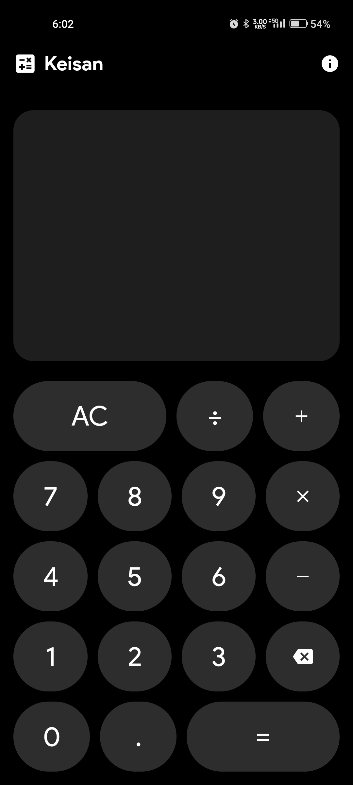
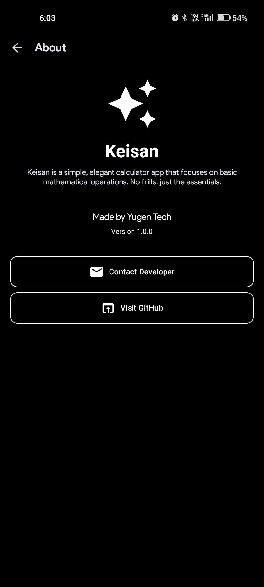

# 🔢 Keisan - Your Everyday Calculator Companion

Welcome to **Keisan**, a modern and lightweight calculator built for everyday use. Designed with simplicity, precision, and elegance in mind, Keisan helps you perform quick calculations effortlessly — whether it's daily expenses, work tasks, or learning sessions.

---

## ✨ Features

- **Standard Calculations**: Perform addition, subtraction, multiplication, and division with ease.
- **Elegant UI**: Minimalistic and beautiful interface built using Jetpack Compose.
- **Instant Results**: Real-time calculation updates without extra button presses.
- **Lightweight & Fast**: Optimized for performance, ensuring a smooth user experience even on low-end devices.
- **Theme Friendly**: Calming design that fits both light and dark themes.

---

## 🎨 UI Highlights

- **Modern Design**: Clean button layouts, soft color palette, and intuitive interactions.
- **Dynamic Layouts**:
  - A **Simple Home Screen** with a calculator keypad and result display.
- **Smooth Animations**: Subtle transitions enhance the experience without getting in the way.

---

## 🚀 Technologies Used

- **Language**: Kotlin  
- **UI Framework**: Jetpack Compose  
- **Architecture**: Simple, using clean state management with Compose best practices  

---

## 📸 Screenshots

<div align="center">
  




</div>

---

## 🛠️ Setup & Installation

1. **Clone the Repository**:
   ```bash
   git clone https://github.com/MohammadAliUstad/Keisan.git
   cd keisan
   ```
2. **Open in Android Studio**: Import the project and sync Gradle files.  
3. **Run**: Build and run the app on an emulator or physical device.

---

## 🌟 Contributing

Have ideas to make Keisan even better?  
Contributions are always welcome! Feel free to fork the repository, make improvements, and submit a pull request.

---

## 📞 Contact

Got suggestions, feedback, or collaboration ideas? Reach out to me:  
📧 **Mohammadaliustad@gmail.com**

---

**Made with ❤️ for simplicity by Yugen Tech**

---
